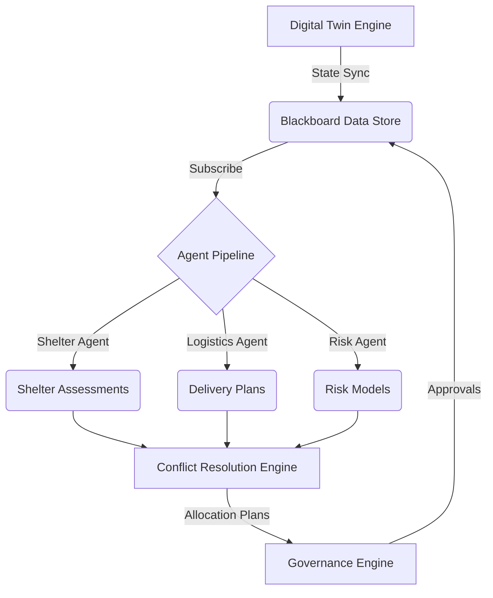

```mermaid
graph TD;
    A[Digital Twin Engine] -->|State Sync| B(Blackboard Data Store);
    B -->|Subscribe| C{Agent Pipeline};
    C -->|Shelter Agent| D(Shelter Assessments);
    C -->|Logistics Agent| E(Delivery Plans);
    C -->|Risk Agent| F(Risk Models);
    D --> G[Conflict Resolution Engine];
    E --> G;
    F --> G;
    G -->|Allocation Plans| H[Governance Engine];
    H -->|Approvals| B;
```