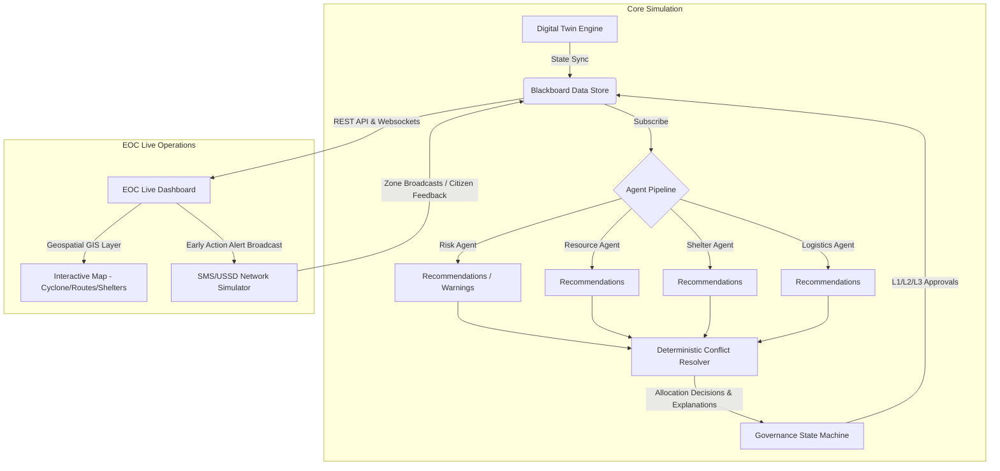

```mermaid
graph TD;
    subgraph Core Simulation
        A[Digital Twin Engine] -->|State Sync| B(Blackboard Data Store);
        B -->|Subscribe| C{Agent Pipeline};
        C -->|Risk Agent| D[Recommendations / Warnings];
        C -->|Resource Agent| E[Recommendations];
        C -->|Shelter Agent| F[Recommendations];
        C -->|Logistics Agent| G[Recommendations];
        D & E & F & G --> H[Deterministic Conflict Resolver];
        H -->|Allocation Decisions & Explanations| I[Governance State Machine];
        I -->|L1/L2/L3 Approvals| B;
    end
    
    subgraph EOC Live Operations
        B -->|REST API & Websockets| J[EOC Live Dashboard];
        J -->|Geospatial GIS Layer| K[Interactive Map - Cyclone/Routes/Shelters];
        J -->|Early Action Alert Broadcast| L[SMS/USSD Network Simulator];
        L -->|Zone Broadcasts / Citizen Feedback| B;
    end
```