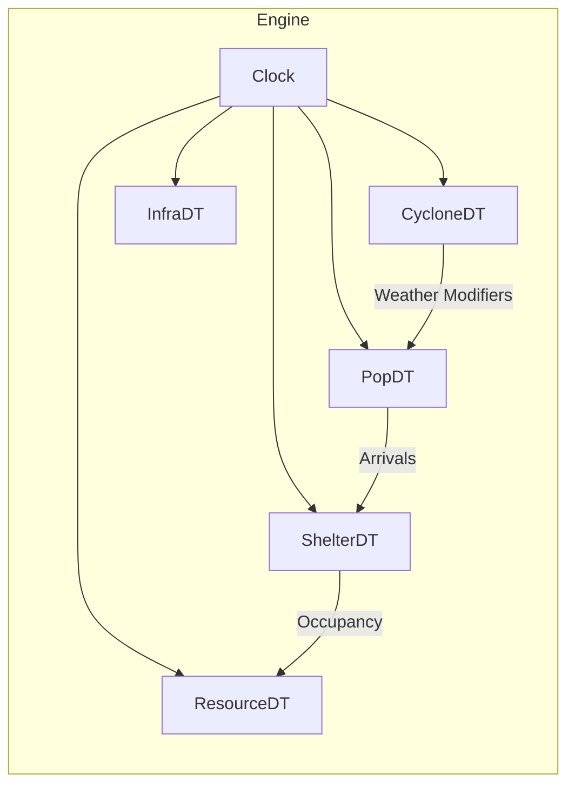

```mermaid
graph LR;
    subgraph Engine
        Clock --> CycloneDT
        Clock --> PopDT
        Clock --> InfraDT
        Clock --> ShelterDT
        Clock --> ResourceDT
    end
    CycloneDT -->|Weather Modifiers| PopDT
    PopDT -->|Arrivals| ShelterDT
    ShelterDT -->|Occupancy| ResourceDT
```