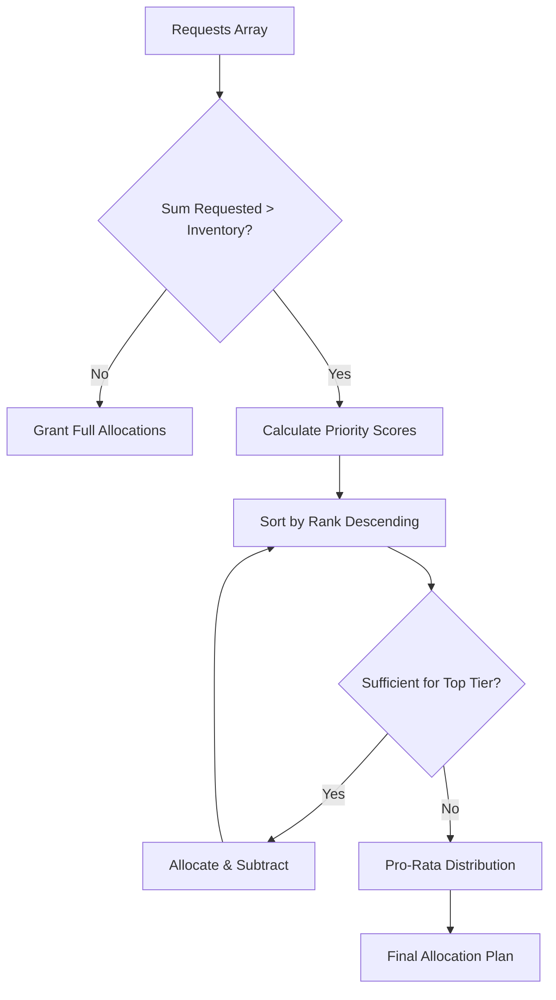

```mermaid
graph TD;
    A[Requests Array] --> B{Sum Requested > Inventory?};
    B -- No --> C[Grant Full Allocations];
    B -- Yes --> D[Calculate Priority Scores];
    D --> E[Sort by Rank Descending];
    E --> F{Sufficient for Top Tier?};
    F -- Yes --> G[Allocate & Subtract];
    G --> E;
    F -- No --> H[Pro-Rata Distribution];
    H --> I[Final Allocation Plan];
```