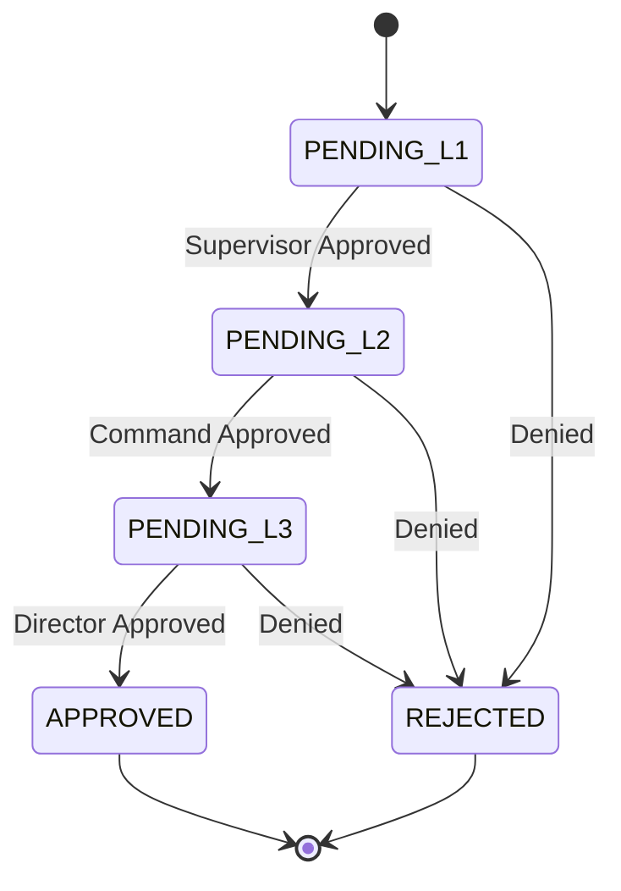

```mermaid
stateDiagram-v2
    [*] --> PENDING_L1
    PENDING_L1 --> PENDING_L2: Supervisor Approved
    PENDING_L1 --> REJECTED: Denied
    PENDING_L2 --> PENDING_L3: Command Approved
    PENDING_L2 --> REJECTED: Denied
    PENDING_L3 --> APPROVED: Director Approved
    PENDING_L3 --> REJECTED: Denied
    APPROVED --> [*]
    REJECTED --> [*]
```